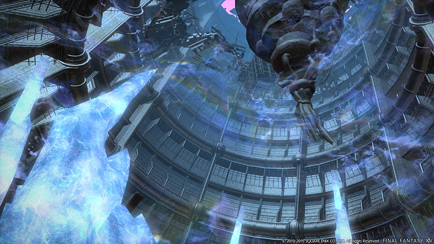
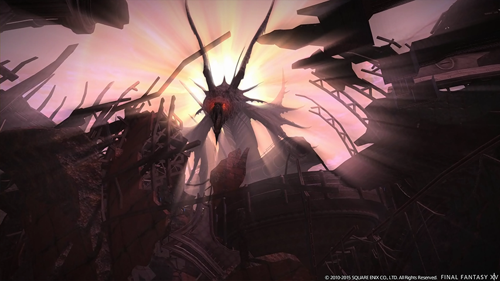

# D029｜幻龍殘骸密約之塔：待編教材

內容 ID：DG029。PvE canonical 建議入場職業：吟遊詩人。這是待編資料，尚未建立或公開課程頁，不加入書庫連結。

2026-10-10 依本人要求，將 R005 中的練習場地與副本機制獨立保留到此。以下來源為 Journey `133814dd4d93d576914545afa6df74f835ab3e77` 的 `pve/courses/r005/index.html`；僅有尾王同心圓與雙龍提醒，不是完整三王講義。正式編寫時須補齊完整流程與機制，並移除最後一段忍者專屬練習語境，改成內容專修的職能責任。原場景圖及來源清單保存在 `../r005/media/`，暫不搬動資產。

## 原教材片段（保留圖解，供後續編修）

```html
<section class="chapter" id="dungeon"><header class="chapter-top"><span>10 · DUNGEON REMINDERS</span><h2>幻龍殘骸密約之塔：尾王回場提醒</h2></header><div class="chapter-body"><figure class="scene"><a href="../r005/media/promo-1.png" target="_blank" rel="noopener noreferrer" aria-label="開啟原圖：幻龍殘骸密約之塔內的金屬船體與藍色晶體"></a><figcaption>練習場地：幻龍殘骸密約之塔。官方場景照亦作為本頁刷淡背景。 <a href="https://na.finalfantasyxiv.com/pr/sp/special/2_5_Before_the_Fall/dungeons/" target="_blank" rel="noopener noreferrer">官方圖片 ↗</a> · © SQUARE ENIX</figcaption></figure>
    <p>本節整理既有共用副本紀錄的兩項操作提醒。<strong>目前涵蓋尾王的同心圓與外場雙龍直線；完整路線、一王與二王攻略尚未收錄。</strong></p>
    <h3>同心圓：看中央已爆區域</h3>
    <div class="callout"><p><strong>先站中圈待機，中央已爆區域一安全就切入。</strong><br>看中央火焰／爆炸結束的安全時點，不把「厭惡」讀條當成同心圓固定爆炸計時器。</p></div>
    <p>重點是辨認場地已爆區域，並及時切進去；只記住技能讀條，仍可能錯過真正的移動時點。</p>
    <h3>外場雙龍：抓橫向安全距離</h3>
    <div class="callout"><p><strong>兩隻幻影龍在外場做直線攻擊時，留意橫向安全距離。</strong></p></div>
    <p>觀察直線攻擊的方向與範圍，讓橫向避讓更乾淨。通關後仍可以繼續練這個細節，不必把擦邊成功當成已經沒有改善空間。</p>
   <figure class="scene"><a href="../r005/media/promo-4.png" target="_blank" rel="noopener noreferrer" aria-label="開啟原圖：塔頂甦醒的幻龍"></a><figcaption>認識尾王所在的場景。官方歷史圖片用於場景辨認；地面判讀按現行教材。 <a href="https://na.finalfantasyxiv.com/pr/sp/special/2_5_Before_the_Fall/dungeons/" target="_blank" rel="noopener noreferrer">官方圖片 ↗</a> · © SQUARE ENIX</figcaption></figure><figure class="tactical-diagram"><svg viewBox="0 0 660 250" role="img" aria-labelledby="ring-title ring-desc"><title id="ring-title">同心圓兩步移動示意</title><desc id="ring-desc">左圖先站中圈避開最先爆的中央。右圖中央爆炸結束後移入中央避開外推的環形爆炸。</desc><g font-family="system-ui,sans-serif" font-size="17" text-anchor="middle"><text x="165" y="25" fill="#375d69">① 先在中圈等</text><text x="495" y="25" fill="#375d69">② 中央爆完，切入</text><g stroke="#67838a" stroke-width="2"><circle cx="165" cy="125" r="85" fill="#edf3f2"/><circle cx="165" cy="125" r="57" fill="#d9eddf"/><circle cx="165" cy="125" r="28" fill="#edb59e"/><circle cx="495" cy="125" r="85" fill="#edb59e"/><circle cx="495" cy="125" r="57" fill="#edb59e"/><circle cx="495" cy="125" r="28" fill="#d9eddf"/></g><g fill="#276d55" stroke="#fff" stroke-width="3"><circle cx="165" cy="81" r="9"/><circle cx="495" cy="125" r="9"/></g><text x="165" y="235" fill="#5d736e">綠點＝玩家 · 橘色＝這一步的危險</text><text x="495" y="235" fill="#5d736e">看爆炸結束，再移入中央</text><path d="M300 125h55m-12-10 12 10-12 10" fill="none" stroke="#987c48" stroke-width="3"/></g></svg><figcaption>本站避招示意，非實機畫面；距離、圈寬與節奏不按比例。以實際地面提示為準。</figcaption></figure><figure class="tactical-diagram"><svg viewBox="0 0 660 220" role="img" aria-labelledby="dragon-title dragon-desc"><title id="dragon-title">外場雙龍直線攻擊示意</title><desc id="dragon-desc">兩條紅色直線是幻影龍攻擊，玩家要橫向移入線外，再確認王的內外圈危險。</desc><rect x="155" y="25" width="350" height="155" rx="16" fill="#edf3f2" stroke="#67838a" stroke-width="2"/><g fill="#edb59e"><rect x="205" y="25" width="55" height="155"/><rect x="390" y="25" width="55" height="155"/></g><g font-family="system-ui,sans-serif" font-size="16" text-anchor="middle" fill="#375d69"><text x="232" y="18">幻影龍</text><text x="417" y="18">幻影龍</text><text x="330" y="205">橫向離開直線，再確認內外圈</text></g><circle cx="305" cy="100" r="9" fill="#276d55" stroke="#fff" stroke-width="3"/><path d="M239 100h51m-10-8 10 8-10 8" fill="none" stroke="#276d55" stroke-width="3"/></svg><figcaption>本站雙龍直線示意，非實機畫面；雙龍所在方位會改變，這張圖不能背成固定安全座標。</figcaption></figure><div class="callout green"><p><strong>這段要練的是忍者如何回到輸出。</strong><br>同心圓先切入安全處，再接回連段；外場雙龍先確認安全位置，再完成結印。避招時機不因爆發技能亮起而改變。</p></div></div></section>
```
